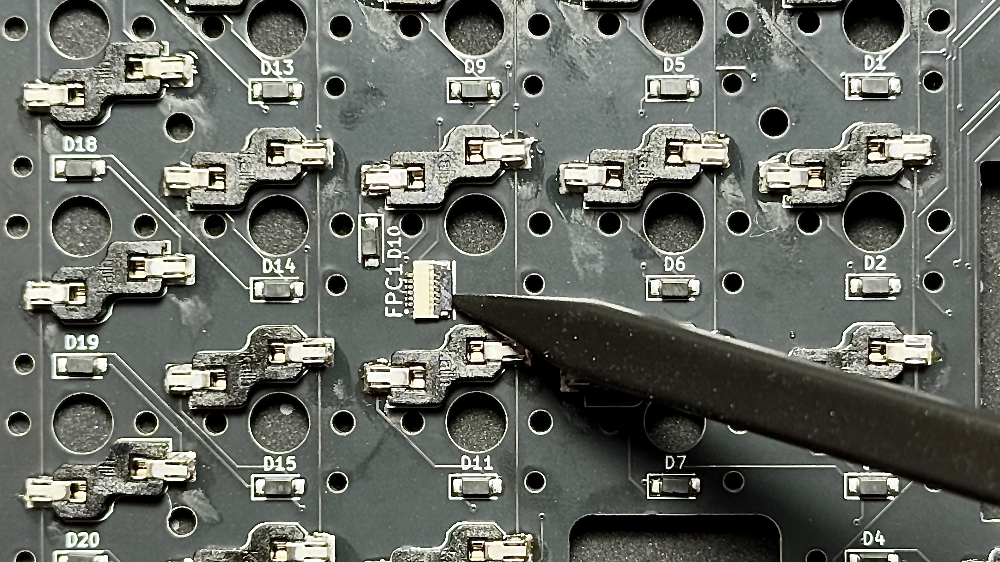
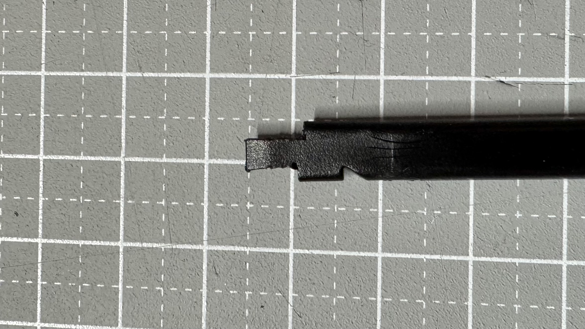
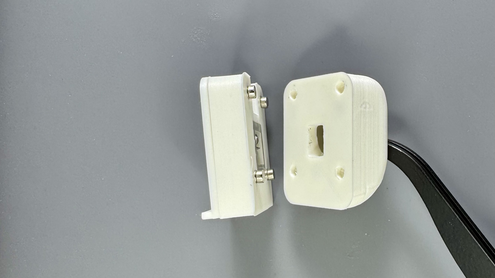

自作キーボード`LisM`のビルドガイドです。  
購入時に組み立てオプションがない・選択しなかった場合はご自身での組み立てが必要です。   
本ドキュメントを参照し、組み立ててください。

## 組み立て前の確認

### モジュールの固定方式

2026年10月1日販売分から、本体とモジュールの固定を**はめ込み式**に変更しました。  
本体固定用のマグネットは不要です。

:::caution[従来のマグネット式とは互換性がありません]
本体・モジュールともに、はめ込み式のケースを使用してください。  
旧マグネット式ケースを組み立てる場合は、各ガイドの「旧マグネット式ケースのみ」の手順をご確認ください。
:::

:::tip[基板を取り付ける前に、ケースのはめ込みを確認]
はめ込み式のケースは、初回の取り付けが非常に固い場合があります。基板をケースに組み込む前に、モジュールケースを一度本体にはめ込み、取り付け・取り外しを確認しておくと安心です。
:::

取り付け・取り外しは、[モジュール付け替えの手順](../how2#モジュール付け替え)をご覧ください。

## 組み立ての基本作業

### はんだ付け

適宜フラックスや予備はんだを使用してください。

### FFCコネクタの取り扱い

FFCコネクタのアクチュエータは壊れやすいため、同梱のスパッジャーで慎重に開閉してください。

スパッジャーは、ニッパー等で画像のように加工すると、各モジュールのアクチュエータを開閉しやすくなります。

### マグネットの取り付け

マグネットを使用する箇所は、接続する相手側と引き合うように**極性を確認してから**固定してください。

1. 接続する相手側にマグネットを付け、ケースを軽く押し当てて仮止めします。
2. 机や定規などの平らな面を使い、ケースに対して垂直にまっすぐ押し込んでください。

金属製の平たい物（筆者はダイソーのステンレス定規を使用）にマグネットを付け、ケースを押し当てる方法もおすすめです。

ケースへのはめ込みで固定できますが、緩い場合は接着剤([オススメ](https://link.amazon/B00IsKbqJ)広告)で固定してください。
