import CaseFittingNotice from '../../../../../components/CaseFittingNotice.astro';
import { Tabs, TabItem } from '@astrojs/starlight/components';

1Uサイズの`トラックボールセンサー`モジュールのビルドガイドです。  

<CaseFittingNotice />

:::note[センサー基板とケースの種類]
基板には`ver1.x.x`系と`ver2.x.x`系があり、`ver1.x.x`系の方が幅が広くなっています。基板裏面の表記、または商品画像との比較で確認し、対応するケースを使用してください。  
基板のバージョンと、本体への固定方式は別の区分です。

2026年10月から、トラックボールとの接続部分は**凹凸タイプ**のみの取り扱いです。従来のフラットタイプとは組み合わせられないため、センサーとユニットの両方のケースを凹凸タイプに揃えてください。
:::

## 内容物
<Tabs syncKey="sensor_case_version">
<TabItem label="はめ込み式">
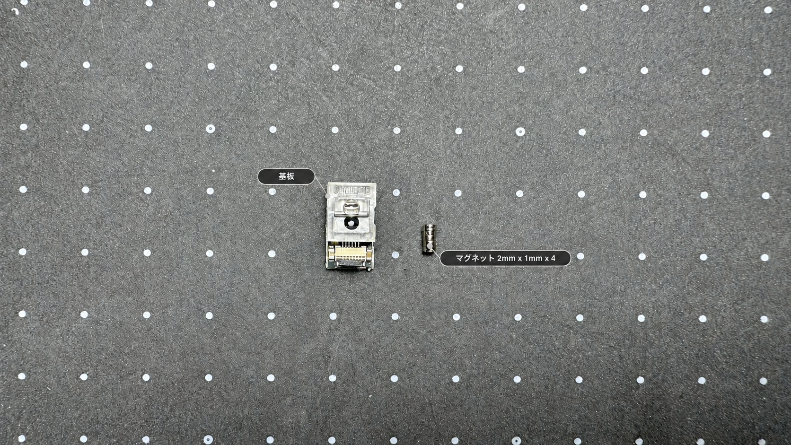

| 部品名 | 数量 | 備考 |
| :--- | :--- | :--- |
| 基板 | 1 | PAW3222搭載 |
| マグネット | 4 | 2mm x 1mm トラボユニット接続用 |

</TabItem>
<TabItem label="旧マグネット式">
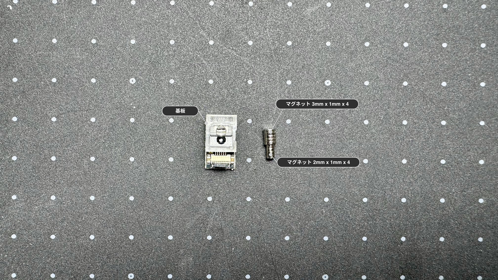

| 部品名 | 数量 | 備考 |
| :--- | :--- | :--- |
| 基板 | 1 | PAW3222搭載 |
| マグネット | 4 | 3mm x 1mm 本体接続用 |
| マグネット | 4 | 2mm x 1mm トラボユニット接続用 |

</TabItem>
<TabItem label="旧ネジ式">
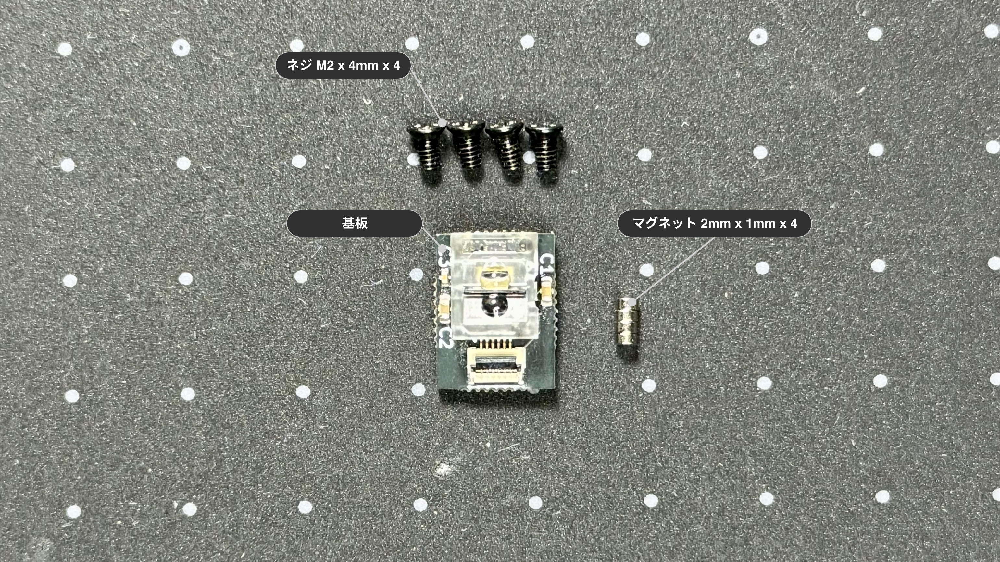

| 部品名 | 数量 | 備考 |
| :--- | :--- | :--- |
| 基板 | 1 | PAW3222搭載 |
| ネジ | 4 | M2 x 4mm |
| マグネット | 4 | 2mm x 1mm |

</TabItem>
</Tabs>

## ケース

<Tabs syncKey="sensor_case_version">
<TabItem label="はめ込み式">
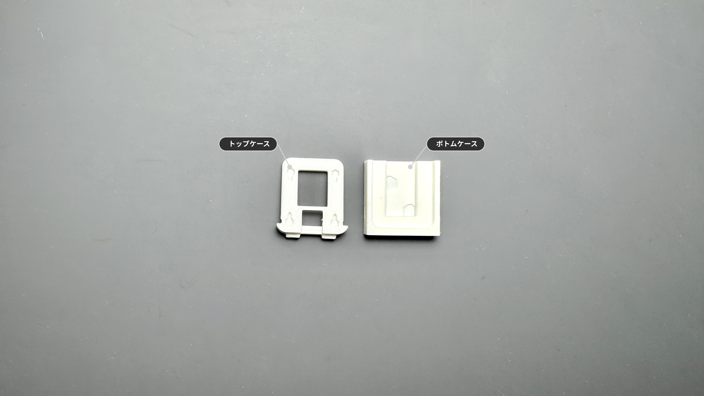

:::note[ケースをご自身で用意される方は]
[ケースデータ](https://github.com/4mplelab/LisM/tree/main/3d-data/case/modules)の`TrackBallSensor_SnapFit.step`を参照ください。
:::

| 部品名 | モデル名 | 備考 |
| :--- | :--- | :--- |
| トップケース | TopPart | |
| ボトムケース | BottomPart | |

</TabItem>
<TabItem label="旧マグネット式">
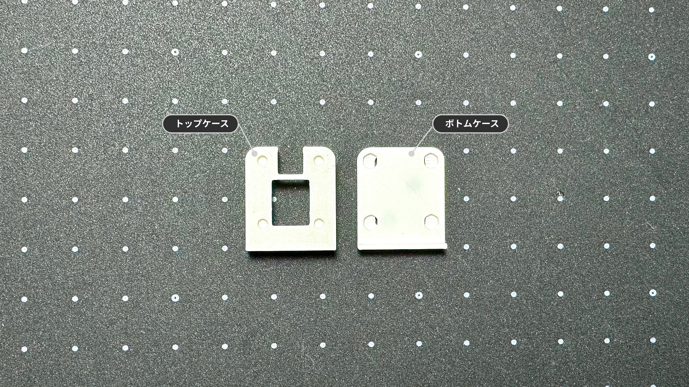

:::note[ケースをご自身で用意される方は]
[ケースデータ](https://github.com/4mplelab/LisM/tree/main/3d-data/case/modules)の`TrackBallSensor_SnapFit.step`を参照ください。
:::

| 部品名 | モデル名 | 備考 |
| :--- | :--- | :--- |
| トップケース | TopPart | |
| ボトムケース | BottomPart | |

</TabItem>
<TabItem label="旧ネジ式">
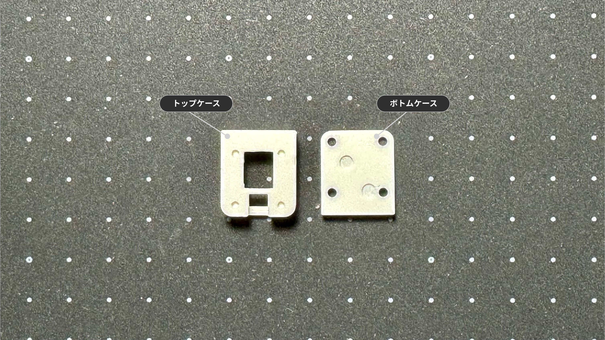

:::note[ケースをご自身で用意される方は]
[ケースデータ](https://github.com/4mplelab/LisM/tree/main/3d-data/case/modules)の`TrackBallSensor.step`を参照ください。
:::

| 部品名 | モデル名 | 備考 |
| :--- | :--- | :--- |
| トップケース | TopPart | |
| ボトムケース | BottomPart | |

</TabItem>
</Tabs>

## 別途必要なもの

| 部品 | 数量 | 備考 |
| :--- | :--- | :--- |
| 任意 接着剤 | - | マグネット固定用 ([オススメ](https://link.amazon/B00IsKbqJ)広告) |

---

## 組み立て手順 

### 1. トップケースへマグネット取り付け
1. 4カ所へマグネット(φ2mm)を取り付けてください。
   
    :::caution[トラックボールユニットのマグネットの極性に合わせる必要があります]
    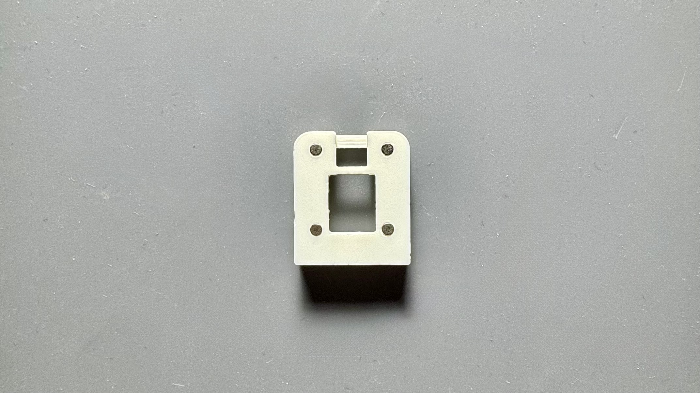
    :::

### 2. ケース組み立て

     
<Tabs syncKey="sensor_case_version">
<TabItem label="はめ込み式">
1. FFCコネクタの位置を確認し、ボトムケースへ基板を入れてください。  
    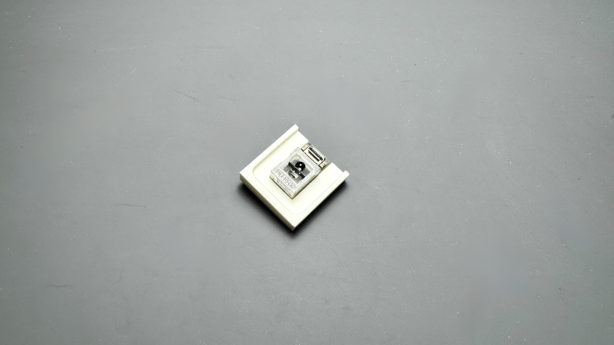  
    :::caution[嵌合が固くて嵌らない場合、基板側面を軽く削ってください]
    :::
   
2. トップケースとボトムケースを合わせて嵌めてください。
    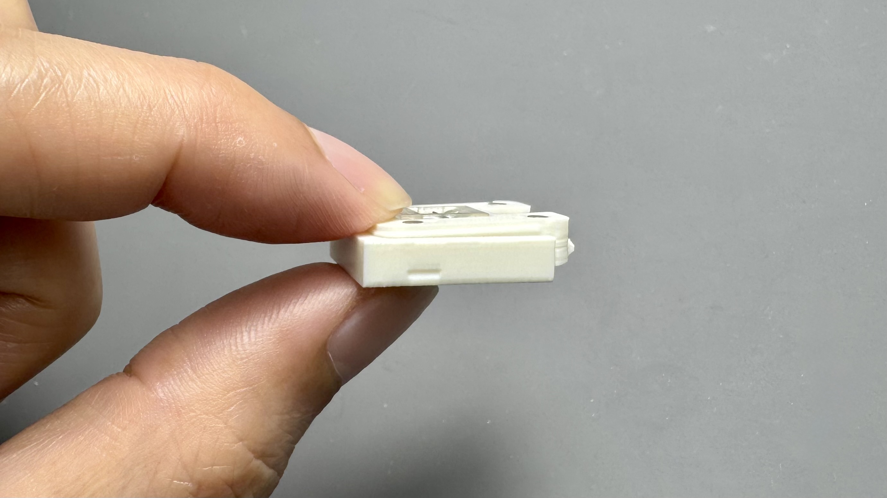  

完成

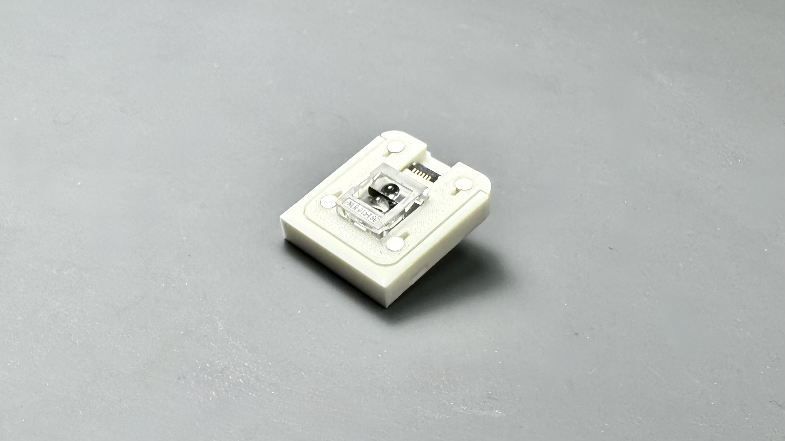
</TabItem>
<TabItem label="旧マグネット式">
1. ボトムケースへマグネット(φ3mm)を取り付けてください。  
    :::caution[本体のマグネットの極性に合わせる必要があります]
    :::
    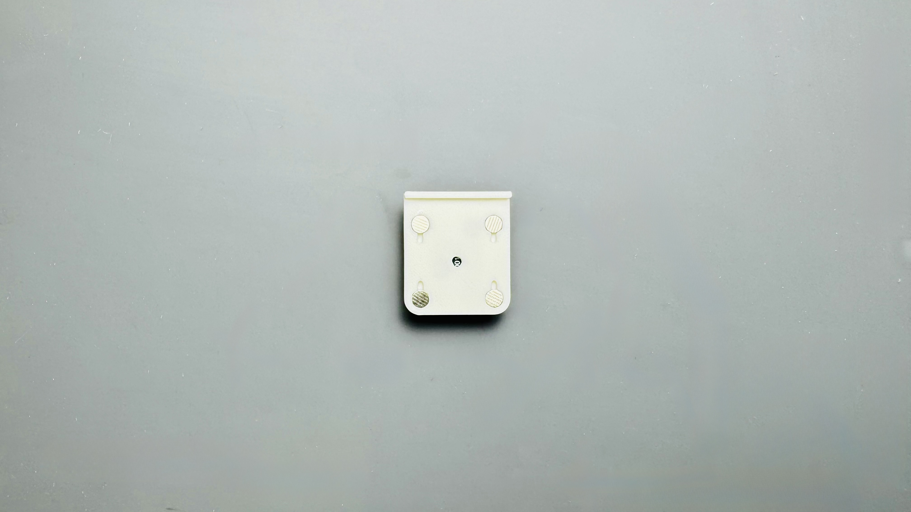

1. FFCコネクタの位置を確認し、ボトムケースへ基板を入れてください。  
      
    :::caution[嵌合が固くて嵌らない場合、基板側面を軽く削ってください]
    :::
   
1. トップケースとボトムケースを合わせて嵌めてください。
    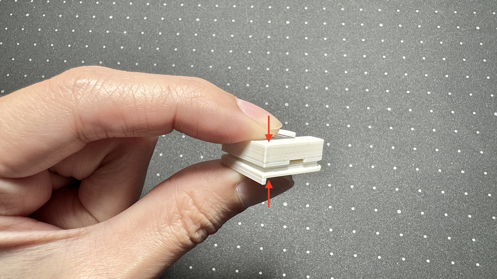  

完成

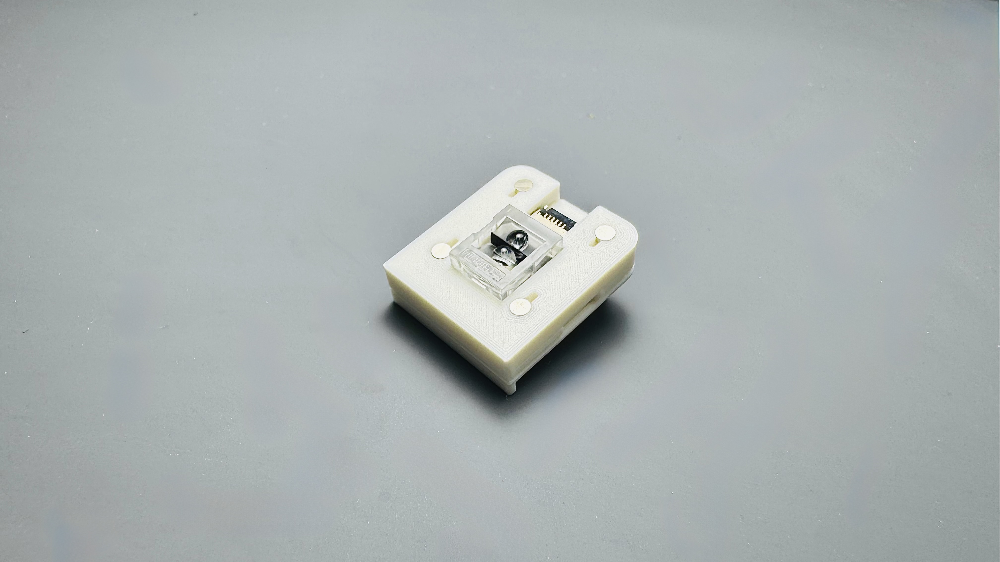
</TabItem>
<TabItem label="旧ネジ式">
1. FFCコネクタの位置を確認し、トップケースへ基板を入れてください。  
    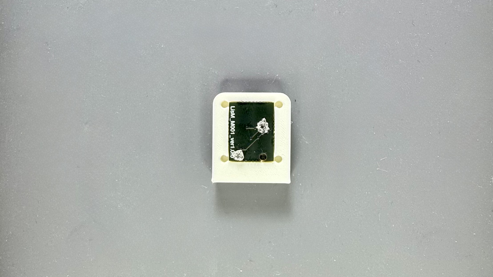
2. ボトムケースをM2ネジで固定して完成です。(締め過ぎ注意)  
    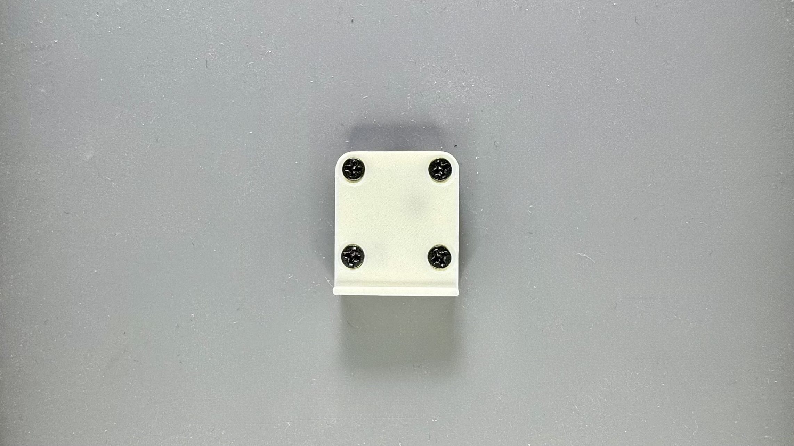  

完成

</TabItem>
</Tabs>

:::note[トップケースとボトムケースで隙間が空く場合]
基板裏面のレンズ固定箇所が干渉している可能性があります。  
気になる方はニッパー等で切り、干渉を除去してください。(削りすぎ注意)   
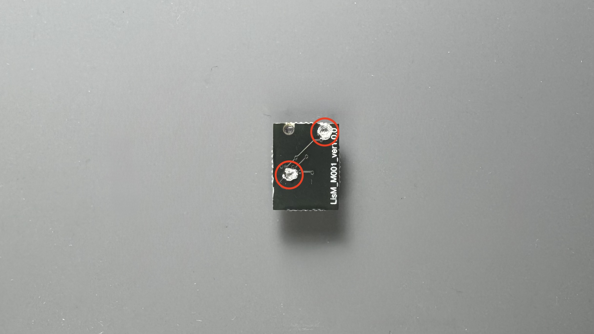
:::

---

## 本体への取り付け
組み立てたモジュールは、[モジュール付け替えの手順](../../../how2#モジュール付け替え)を参考に本体に取り付けてください。