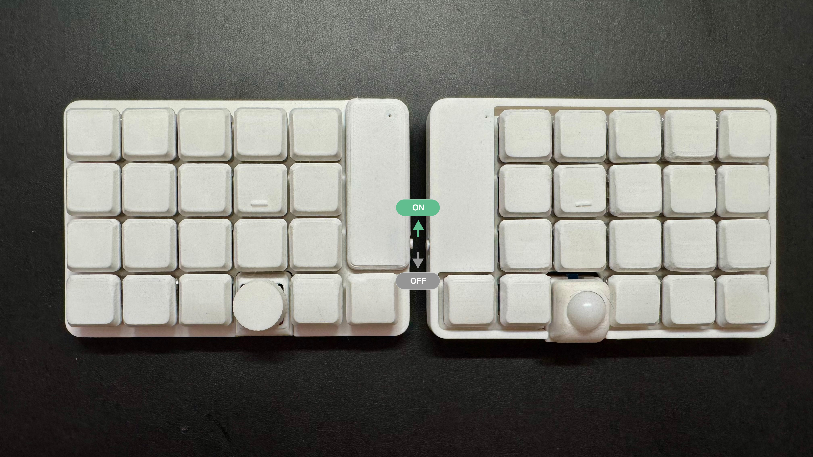
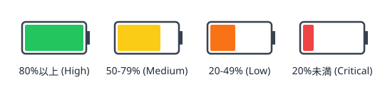
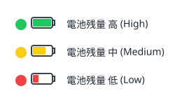
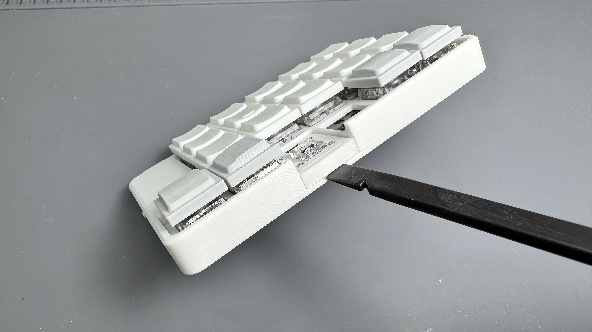
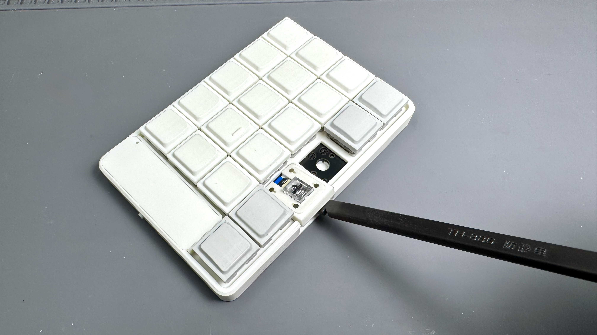
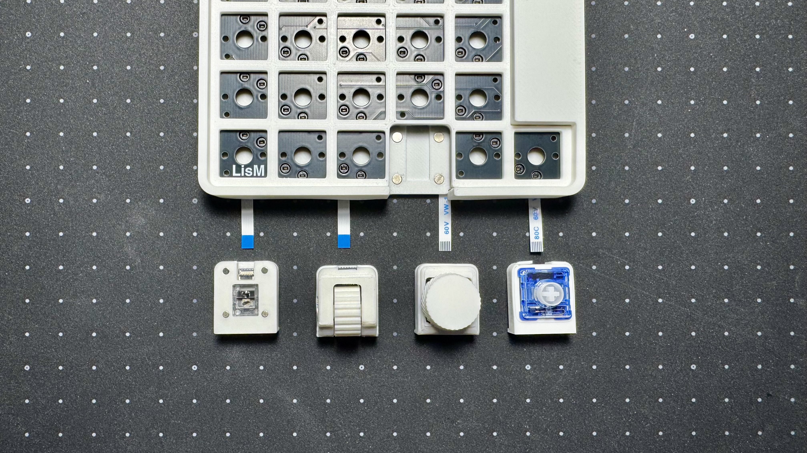
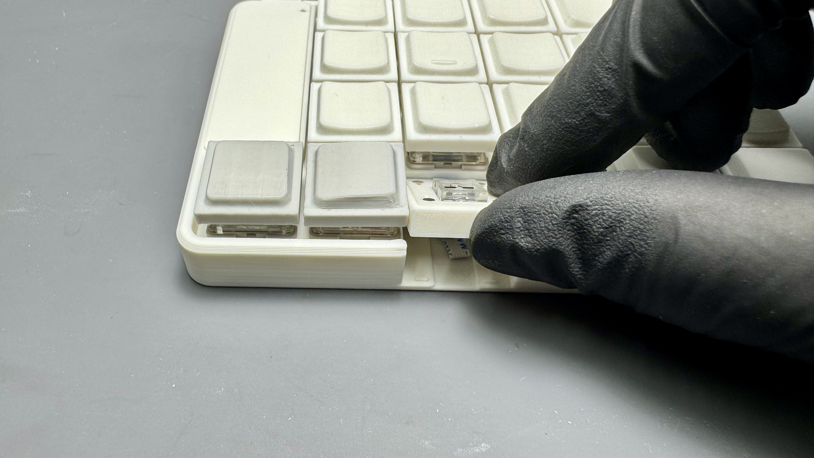
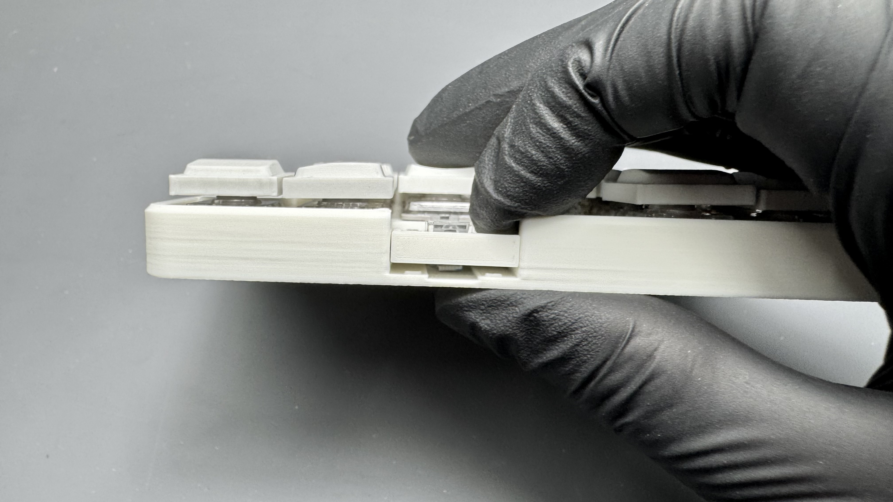
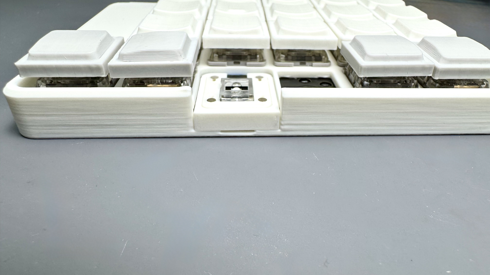

## 電源ON/OFF
キーボードの側面にあるスライドスイッチで電源のON/OFFを切り替えます。 
  
ONにするとLEDインジケーターが点灯し、起動状態を示します。

---

## 充電
電源スイッチをONの状態でUSB接続すると充電されます。  
充電中は電池残量に応じてインジケーターが変化します。  

---

## デバイスへの接続
`LisM`は、Bluetooth（最大5台）でデバイスに接続できます。

### 1台目のデバイスを接続する (Bluetooth)
1.  キーボードの電源をONにします。
2.  接続したいデバイス（PCなど）のBluetooth設定画面を開き、検出された「LisM」を選択してペアリングします。
3.  ペアリングが完了すると、デバイスは自動的に1番目のスロット（`BT_SEL 0`）に登録されます。

### 2台目以降のデバイスを接続する (マルチペアリング)
1.  **キーボードの接続先スロットを切り替える**  
    `BT_SEL 1` など、まだ使われていないスロットに切り替えます。（キーマップで設定したキーを押してください）
2.  **他のデバイスのBluetoothをOFFにする**  
    安定したペアリングのため、すでにLisMと接続済みのデバイス（1台目のPCなど）のBluetoothを一時的にOFFにします。
3.  **新しいデバイスとペアリングする**  
    新しく接続したいデバイス（スマートフォンやタブレットなど）のBluetooth設定画面から「LisM」を選択し、ペアリングします。
4.  **他のデバイスも同様に登録する**  
    この手順を繰り返し、最大5台までデバイスを登録できます。（`BT_SEL 0` 〜 `BT_SEL 4`）

### 接続先を切り替える
一度ペアリングしたデバイス間は、キーマップで設定した `BT_SEL 0` 〜 `BT_SEL 4` のキーを押すだけで、瞬時に接続先を切り替えることができます。

### 登録デバイスの削除
キーマップで設定した `BT_CLR` キーを押すと、現在選択しているスロットのペアリング情報が削除されます。

---

## LEDインジケーター

LisMは[RGBLED Widget](https://github.com/caksoylar/zmk-rgbled-widget)を使用して、キーボードのLEDでバッテリー残量やBluetooth接続状態を視覚的に通知します。  
キーボードの起動時に**電池残量→接続状態の順**で表示されます。

### 電池残量の表示
起動時やバッテリーレベルの変動時に、現在の電池残量をLEDの色で示します。  

### 接続状態の表示
起動時やBluetoothプロファイルの切り替え時に、現在の接続状態をLEDの色で示します。  

---

## リセット
接続がうまくいかない・モジュールが動かない場合などは、**リセット用ファームウェアを書き込んで設定を初期化**します。

1. [ファームウェアの書き込み手順](../firmware#ファームウェアの書き込み手順)に従い、左右それぞれにリセット用ファームウェアを書き込んでください。
2. リセット後、左右それぞれに[モジュール構成に合ったファームウェア](../firmware#モジュール構成とファームウェア)を書き込み直してください。
3. PCなどの接続先に保存されているLisMのBluetooth登録を削除し、再度ペアリングしてください。

:::caution[保存済みの設定が初期化されます]
Bluetoothのペアリング情報などが消去されます。リセット用ファームウェアを書き込んだままでは通常使用できないため、必ず使用するファームウェアを書き込み直してください。
:::

---

## モジュール付け替え

LisMは、用途に応じてモジュールを付け替えることができます。

:::caution[ケースの固定方式を確認してください]
2026年10月1日販売分から、本体とモジュールの固定は**はめ込み式**です。  
本体・モジュールともに、はめ込み式のケースが必要です。従来のマグネット式とは組み合わせられません。
:::

### 1. 電源をOFFにする
作業前に、必ずキーボードの電源をOFFにしてください。

### 2. モジュールを取り外す

**はめ込み式**

1. キーボードを平らな場所に置き、本体を支えます。  
   モジュールの手前側と本体の境目にある隙間へ、スパッジャーの先端を**5mm程度**差し込んでください。  
   

2. スパッジャーの**持ち手側（先端と反対側）をゆっくり持ち上げ**、てこの原理で手前側の固定を外します。  
   

3. 手前側が浮いたらモジュールのケースを持ち、奥側の爪を抜いて取り外してください。  
   FFCが接続されているため、勢いよく引っ張らないでください。

:::caution[ケースとFFCを傷めないように注意]
スパッジャーを奥まで差し込んだり、無理にこじったりしないでください。基板やFFCに工具を当てず、ケースの部分で作業してください。
:::

**旧マグネット式**：ケースを持って持ち上げ、マグネットの固定を外してください。

### 3. FFCケーブルを差し替える
モジュールのコネクタの黒いアクチュエータを上げてFFCを抜き、付け替えたいモジュールのコネクタへ差し込んでから、アクチュエータを閉じます。  
アクチュエータは壊れやすいので、付属のスパッジャーなどを使って慎重に操作してください。

:::tip[モジュールのFFCの向き]
以下の画像の向きで接続してください。

:::

19mmトラックボールへの付け替えは、[専用の手順](../build_guides/units/trackball_19mm#付け替え方法)に従ってセンサーとFFCを取り回してください。

### 4. モジュールを取り付ける
FFCをケース内へ収め、挟まないように避けてください。

**はめ込み式**

1. モジュールの手前側を持ち上げた状態で、**奥側の爪を斜めに奥まで差し込み、本体基板の裏側に引っかけます**。  
   

2. 奥側の爪を引っかけたまま、**手前側を下ろします**。  
   本体の下側を支えながらケースの手前側を押し、凹凸をはめ込んで固定してください。  
   

3. ケースに浮きがなく、しっかり固定されていることを確認してください。  
   

**旧マグネット式**：位置を合わせ、マグネットで固定してください。

### 5. ファームウェアを書き換える
使用するモジュールの構成に合わせて、適切なファームウェアを書き込む必要があります。  
詳細は[ファームウェア](/LisM/firmware/)を参照してください。

### 6. 電源をONにする
ファームウェアの書き込みが完了したら、電源をONにして動作を確認してください。

---

## キーマップ変更
キーマップの変更方法は、[ファームウェア](../firmware#キーマップの変更方法)のページを参照してください。